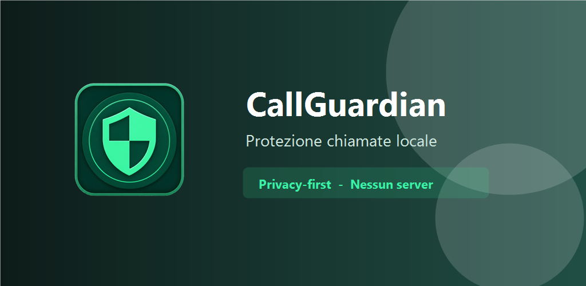
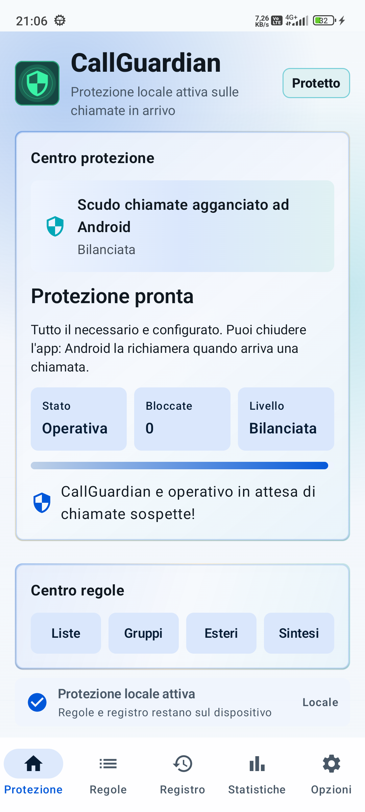
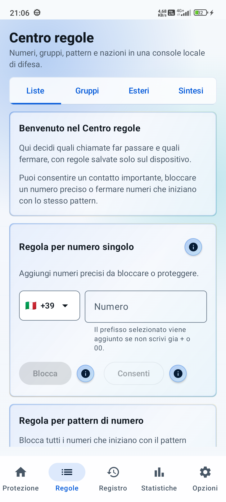
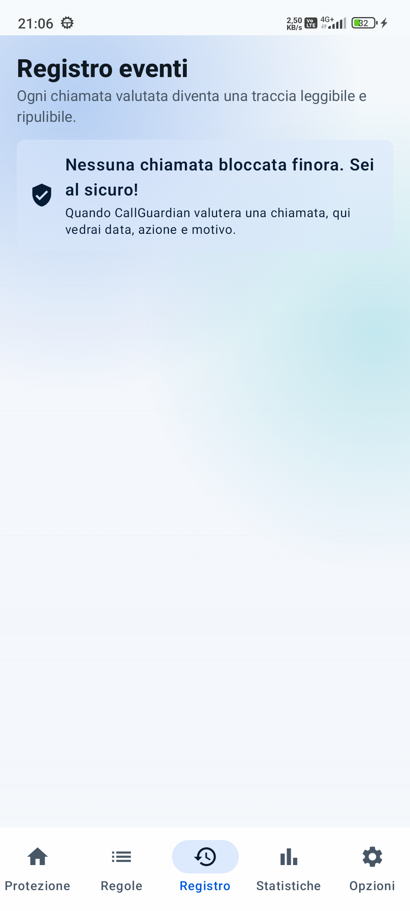
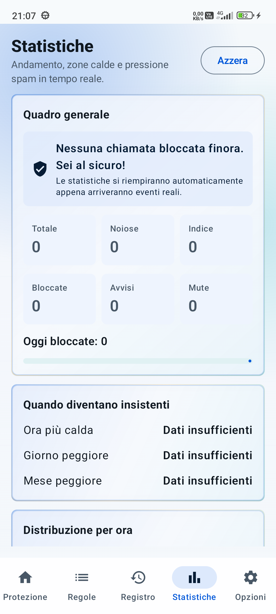
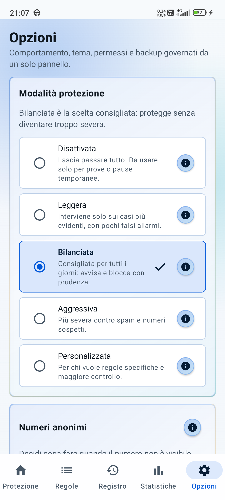
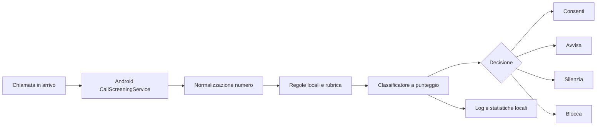

# CallGuardian

<p align="center">
  
</p>

<h3 align="center">Protezione chiamate Android, locale e privacy-first.</h3>

<p align="center">
  Filtra spam, chiamate anonime, numeri sospetti e prefissi indesiderati senza account, senza server obbligatorio e senza caricare la rubrica nel cloud.
</p>

<p align="center">
  
  
  
  
</p>

<p align="center">
  
</p>

## Perché Esiste

CallGuardian nasce per dare controllo reale sulle chiamate in arrivo: bloccare ciò che è rischioso, avvisare quando serve prudenza e lasciare passare i contatti importanti. Il punto forte è il modello locale: regole, log, statistiche e classificazione restano sul dispositivo.

## Funzionalità

- Protezione chiamate tramite `CallScreeningService` Android.
- Blocco di numeri, prefissi, range, nazioni e chiamate anonime.
- Whitelist locale per contatti e numeri sempre consentiti.
- Gestione chiamate estere con modalità avviso, blocco selettivo o blocco per nazione.
- Classificazione locale a punteggio con priorità regole configurabile.
- Registro eventi con azione, motivo, punteggio, paese e regola applicata.
- Statistiche locali su chiamate bloccate, categorie, orari e paesi.
- Notifiche e overlay opzionale per chiamate sospette.
- Backup/export JSON locale.
- Tema chiaro, scuro o automatico, con palette selezionabili.
- Database locale cifrato con SQLCipher e chiave protetta da Android Keystore.
- Interfaccia localizzata in italiano, inglese, spagnolo, francese, tedesco e portoghese.

## Anteprima

| Protezione | Regole | Registro | Statistiche | Opzioni |
|---|---|---|---|---|
|  |  |  |  |  |

## Privacy

CallGuardian è progettata per funzionare completamente in locale.

Non invia obbligatoriamente a server esterni:

- rubrica;
- cronologia chiamate;
- blacklist o whitelist;
- statistiche;
- numeri telefonici;
- regole configurate dall'utente.

Il database dell'app è cifrato localmente. I backup automatici Android escludono i dati sensibili configurati nelle regole di backup del progetto.

## Come Funziona



Nota Android: per bloccare davvero le chiamate, l'utente deve assegnare a CallGuardian il ruolo di app "ID chiamante e spam" (`ROLE_CALL_SCREENING`). L'app guida l'utente nella configurazione.

## Stack

- Kotlin
- Android SDK 35
- Jetpack Compose e Material 3
- MVVM
- Hilt
- Room
- SQLCipher
- WorkManager
- Gson
- libphonenumber
- JUnit

## Requisiti

- Android Studio Ladybug o superiore
- JDK 17
- Android SDK con `compileSdk 35`
- Gradle Wrapper incluso
- Dispositivo o emulatore Android API 29+

## Avvio Rapido

Build debug:

```powershell
.\gradlew.bat :app:assembleDebug
```

Unit test:

```powershell
.\gradlew.bat :app:testDebugUnitTest
```

APK generato:

```text
app/build/outputs/apk/debug/app-debug.apk
```

Smoke test ADB, con dispositivo collegato e debug USB attivo:

```powershell
.\scripts\test-adb.ps1
```

Gli artefatti dello smoke test vengono salvati in `build/adb-smoke/`.

## Struttura

```text
.
|-- app/
|   |-- src/main/java/com/callguardian/app/
|   |   |-- core/          # modelli, permessi e logica dominio
|   |   |-- data/          # Room, repository, backup e classificatore
|   |   |-- di/            # moduli Hilt
|   |   |-- telephony/     # CallScreeningService, normalizzazione e notifiche
|   |   |-- ui/            # Compose UI, navigazione, tema e schermate
|   |   `-- viewmodel/     # ViewModel MVVM
|   `-- src/test/          # unit test
|-- docs/
|   |-- assets/            # screenshot e materiali GitHub
|   `-- play/              # schede, privacy policy e asset Play Store
|-- release/               # pacchetto pubblicazione Play Store
|-- scripts/               # smoke test ADB
|-- BUILD_AND_TEST.md
|-- GENERATED_FILES.md
`-- callguardian_specifica_tecnica_completa.md
```

## Documentazione

- [Build e test](BUILD_AND_TEST.md)
- [File generati](GENERATED_FILES.md)
- [Specifica tecnica completa](callguardian_specifica_tecnica_completa.md)
- [Store listing Play Store](docs/play/store-listing-it.md)
- [Privacy policy](docs/play/privacy-policy-it.html)
- [Checklist rilascio](docs/play/release-checklist-it.md)

## Roadmap

- Validazione su più dispositivi Android reali.
- Test strumentali Compose sulle schermate principali.
- Import backup cifrato oltre all'export JSON.
- Miglioramento statistiche con serie temporali più ricche.
- Eventuale sincronizzazione opzionale, esplicita e disattivata di default.

## Contribuire

Leggi [CONTRIBUTING.md](CONTRIBUTING.md) prima di aprire una pull request. Per bug e nuove idee sono disponibili i template GitHub in `.github/ISSUE_TEMPLATE/`.

## Stato

Versione app: `1.0.0`

Il progetto è una base Android reale e funzionante per protezione chiamate locale. Prima della pubblicazione è consigliato validare il comportamento su più dispositivi Android e completare le policy richieste dagli store.

## Licenza

Questo progetto è distribuito sotto licenza Apache License 2.0. Vedi [LICENSE](LICENSE).
