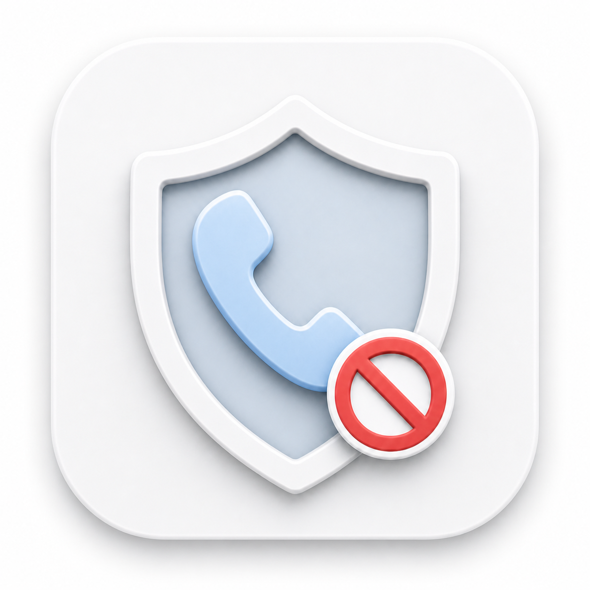

# CallGuardian



CallGuardian e' un'app Android privacy-first per proteggere il telefono da chiamate indesiderate, spam e numeri potenzialmente rischiosi. L'app lavora in locale, usa il servizio Android `CallScreeningService` e permette di gestire regole, paesi, whitelist, blacklist, log e statistiche senza richiedere un server.

## Funzionalita'

- Protezione chiamate tramite `CallScreeningService`.
- Blocco di numeri, prefissi e chiamate anonime.
- Gestione chiamate estere con modalita' di avviso o blocco.
- Whitelist locale per numeri sempre consentiti.
- Classificazione del rischio con priorita' regole configurabile.
- Log eventi con numero, azione, motivo, punteggio e regola applicata.
- Statistiche locali su chiamate bloccate, categorie e paesi.
- Notifiche e overlay per chiamate sospette.
- Backup/export JSON locale.
- Tema chiaro, scuro o automatico, con opzioni di accessibilita'.
- Database locale cifrato con SQLCipher.

## Privacy

CallGuardian e' progettata per funzionare completamente in locale.

Non carica obbligatoriamente su server:

- rubrica;
- cronologia chiamate;
- blacklist o whitelist;
- statistiche;
- numeri telefonici.

Il database dell'app e' cifrato localmente e la chiave viene protetta tramite Android Keystore.

## Stack tecnico

- Kotlin
- Android SDK 35
- Jetpack Compose
- Material 3
- MVVM
- Hilt
- Room
- SQLCipher
- WorkManager
- Gson
- libphonenumber
- JUnit

## Requisiti

- Android Studio Ladybug o superiore
- Android SDK con `compileSdk 35`
- JDK 17
- Gradle Wrapper incluso nel progetto
- Dispositivo o emulatore Android con API 29+

## Build

Da Windows PowerShell:

```powershell
.\gradlew.bat :app:assembleDebug
```

Da macOS/Linux:

```bash
./gradlew :app:assembleDebug
```

APK generato:

```text
app/build/outputs/apk/debug/app-debug.apk
```

## Test

Unit test:

```powershell
.\gradlew.bat :app:testDebugUnitTest
```

Build debug:

```powershell
.\gradlew.bat :app:assembleDebug
```

Smoke test ADB, con dispositivo collegato e debug USB attivo:

```powershell
.\scripts\test-adb.ps1
```

Gli artefatti dello smoke test vengono salvati in:

```text
build/adb-smoke/
```

## Permessi Android

Per funzionare correttamente l'app puo' richiedere:

- `READ_PHONE_STATE`: stato telefonico necessario durante il contesto chiamata.
- `READ_CONTACTS`: controllo dei numeri salvati, utile per le regole sugli sconosciuti.
- `POST_NOTIFICATIONS`: notifiche heads-up su Android 13+.
- `SYSTEM_ALERT_WINDOW`: popup overlay, da abilitare manualmente nelle impostazioni Android.
- Ruolo `ROLE_CALL_SCREENING`: necessario per bloccare realmente le chiamate.

Senza il ruolo di app Caller ID & Spam, Android non consente a `CallScreeningService` di bloccare le chiamate. La schermata Protezione guida l'utente nella configurazione.

## Struttura progetto

```text
.
|-- app/
|   |-- src/main/java/com/callguardian/app/
|   |   |-- core/          # modelli e permessi
|   |   |-- data/          # Room, repository, backup e classificatore
|   |   |-- di/            # moduli Hilt
|   |   |-- telephony/     # CallScreeningService, normalizzazione e notifiche
|   |   |-- ui/            # Compose UI, navigazione, tema e schermate
|   |   `-- viewmodel/     # ViewModel MVVM
|   `-- src/test/          # unit test
|-- scripts/               # script ADB e automazioni locali
|-- BUILD_AND_TEST.md      # note operative di build e test
|-- GENERATED_FILES.md     # mappa dei file generati
`-- callguardian_specifica_tecnica_completa.md
```

## Schermate principali

La navigazione principale include:

1. Protezione
2. Regole
3. Log
4. Statistiche
5. Configurazione

## Note di sviluppo

- `CallScreeningService` va validato su dispositivo reale o emulatore con supporto telefonico.
- ADB non simula sempre una chiamata cellulare in ingresso completa su telefono reale.
- I log locali vengono gestiti da un worker periodico che elimina eventi vecchi.
- I backup automatici Android escludono il database cifrato.

## Documentazione

- [Build e test](BUILD_AND_TEST.md)
- [File generati](GENERATED_FILES.md)
- [Specifica tecnica completa](callguardian_specifica_tecnica_completa.md)

## Stato

Versione app: `1.0.0`

Il progetto e' una base Android reale e funzionante per protezione chiamate locale. Prima della pubblicazione e' consigliato validare il comportamento su piu' dispositivi Android e completare le policy privacy richieste dagli store.

## Licenza

Licenza non ancora specificata.
